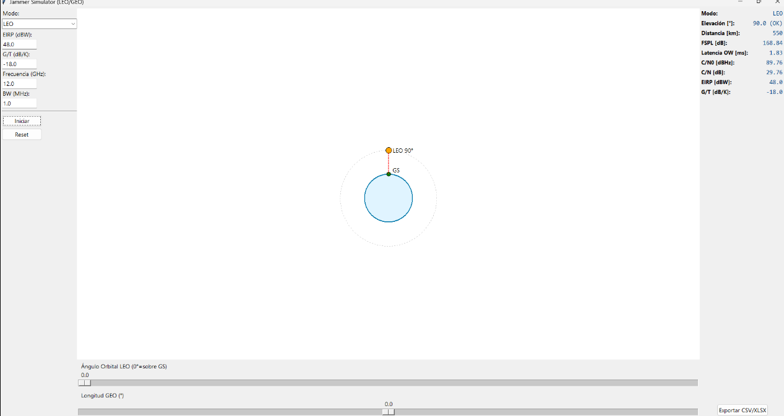

# 🛰️ Educational LEO / GEO Satellite Link SimulCurrent status: **Scenario 1 Complete, Scenario 2 Research Phase**

### ✅ **Scenario 1: LEO Fundamental Validation** *(Completed)*tor & Progressive Jamming Analysis Framework

An evolving project whose core is an interactive Tkinter GUI simulating a single satellite ↔ ground station link. It is designed to: (1) visualise LEO vs GEO orbital geometry, (2) expose and demystify a dynamic link budget, and (3) act as an interference scenarios (jamming), counter‑measures and large–scale constellation resilience analysis.


## 🔍 Overview
The repository currently ships with one self‑contained script `JammerSimulator.py` implementing:
- Parameter loading (JSON) and a thin separation between core state and GUI.
- Simplified 2D rendering of Earth, an animated LEO satellite and a draggable GEO slot.
- Fundamental calculations: slant range, elevation, free space path loss (FSPL), propagation latency, C/N0 and C/N.
- Real‑time metrics panel plus CSV/XLSX historical export.

On top of this base we will iteratively build a modular framework covering operational and hostile phenomena in contemporary satellite systems (mega‑constellations, hybrid links, coordinated attacks, adaptive counter‑measures, environmental degradation, resilience strategies, etc.).

## 🎯 Core Educational Objectives
1. Make the geometric & energy gap between LEO and GEO tangible (distance, FSPL, latency, future Doppler).
2. Provide link budget transparency: every term visible and traceable.
3. Layer complexity gradually: start with “ideal vacuum” (no extra losses, no interference); add factors incrementally with clear rationale.
4. Encourage rapid experimentation: editable parameters + clean exports.
5. Prepare a substrate for advanced evolutions (adaptive jamming, severe weather, hybrid redundancy, systemic resilience).

## ✅ Current State (Advanced Implementation)
- **Realistic Earth Rotation**: Implemented with correct physics (0.004167°/s) and 100x time scaling
- **LEO/GEO Orbital Dynamics**: Real orbital mechanics using v=√(μ/r), ~95min periods for 550km LEO
- **Multi-Body Synchronization**: LEO + Earth + GEO rotate coordinately with proper physics
- **Advanced Time Control**: 0.1s resolution with adjustable sensitivity (0.1x-5.0x)
- **Complete Link Calculations**: FSPL, C/N0, C/N, Eb/N0, latencies, Doppler
- **MODCOD Adaptive**: Full table with spectral efficiencies and required Eb/N0
- **Precise Geometry**: Elevation corrected for Earth rotation, slant distance, visibility
- **Multi-Constellation Architecture**: Framework ready for multiple satellites
- **Enhanced Visualization**: 2D canvas with rotating elements and 35+ real-time metrics
- **Data Export**: Structured CSV/XLSX with professional formatting

## 📊 Metrics & Models (Current Implementation)
| Category  | Implemented                      | Next expansion                                  |
|-----------|----------------------------------|-------------------------------------------------|
| Geometry  | Elevation, slant range, visibility, corrected for Earth rotation | Multi-satellite tracking, orbital inclination |
| Dynamics  | Realistic orbital velocity, periods, Earth rotation (0.004167°/s) | Orbital velocity vectors, range rate, advanced Doppler |
| Power     | EIRP effective with input/output back-off, saturated EIRP | Advanced power control, beam steering          |
| Losses    | FSPL + 7 configurable loss categories (feeder, misalignment, atmospheric, rain, polarization, pointing, implementation) | ITU-R atmospheric models, rain fade statistics |
| Noise     | Complete T_sys, T_rx, T_sky decomposition, N0 | Rain temperature excess, interference degradation |
| Performance| C/N0, C/N, Eb/N0, margin analysis, Shannon capacity, spectral efficiency | BER curves, adaptive coding, QoS metrics      |
| Latency   | One-way, RTT with processing and switching delays | Network latencies, buffering, adaptive delays   |
| Time Control | 0.1s resolution, sensitivity 0.1x-5.0x, manual/auto modes | Time-synchronized multi-constellation         |
| Interf.   | Framework ready                  | C/I, C/(N+I), terrestrial jammers, multi-jammer aggregation |
| Coverage  | Single satellite visibility     | Multi-satellite coverage maps, handover optimization |

## 🗺️ Scenario Implementation Progress
Rather than freezing “scenarios” into the README, we track cumulative functional layers:
- Realistic LEO 550km and GEO 35,786km orbits with correct physics
- Earth rotation synchronized with orbital dynamics  
- Complete link budget: FSPL, C/N0, C/N, Eb/N0, latencies
- MODCOD adaptive selection with spectral efficiency analysis
- 35+ real-time metrics with professional data export
- Validated: orbital mechanics, RF calculations, geometry

### 🔄 **Scenario 2: FCC Angular Discrimination with Terrestrial Jammer** *(Research Phase)*
- Research focus: FCC angular discrimination regulations
- Target: Terrestrial jammer interference modeling
- Implementation: C/I ratios, jammer geometry, tracking algorithms
- Status: Research prompt prepared for technical analysis

### ⏳ **Scenarios 3-11: Planned Evolution**
3. LEO Mega-Constellation with Outage Probability
4. NB-IoT Multi-Beam with Frequency Reuse  
5. Starlink Real-World Validation with Software Updates
6. UPA Arrays with Realistic Beam Pointing
7. Nearest vs Random Jamming Schemes
8. A-FFHR Military Anti-Jamming
9. Ultra-Dense LEO Optimization
10. Rain Effects with Energy Dispersal
11. Multi-Technique Integrated Analysis

Each scenario adds configurable inputs, new metrics and explanatory documentation to preserve physical traceability and conceptual clarity.

## 🧩 Code Architecture (Current Implementation)
```
JammerSimulator.py (~1,500 lines)
 ├─ ParameterLoader            (JSON parameter ingestion with validation)
 ├─ Satellite / Constellation  (orbital model + multi-constellation framework)  
 ├─ MultiConstellation         (framework for multiple satellite systems)
 ├─ LEOEducationalCalculations (core formulas: FSPL, C/N0, latency, Doppler)
 ├─ JammerSimulatorCore        (shared state + LEO/GEO calculators)
 └─ SimulatorGUI (Tkinter)     (advanced controls, time management, 35+ metrics, export)
```
Current implementation includes realistic Earth rotation, multi-body synchronization, and advanced time control. Future extensions will factor out jamming modules (`interference.py`, `jammers.py`, `countermeasures.py`) to maintain educational clarity.

## ▶️ Current Usage Flow
1. Run `python JammerSimulator.py`.
2. Select LEO or GEO mode.
3. Adjust EIRP, G/T, frequency, bandwidth, and loss parameters.
4. **Time Control Options:**
   - **Automatic Mode**: Start animation with real-time orbital dynamics
   - **Manual Mode**: Enable fine control sliders for precise positioning
   - **Sensitivity**: Adjust time scale (0.1x-5.0x) for detailed analysis
5. **Advanced Features:**
   - Drag time slider (0.1s resolution) to jump to specific simulation moments
   - Configure MODCOD, back-off, noise temperatures, and processing delays
   - Monitor 35+ real-time metrics including orbital geometry and link quality
6. Export complete time series to CSV/XLSX for offline analysis and validation.

## ⚡ Quick Install
Minimum: Python 3.10+ (Tkinter usually bundled). Optional: `openpyxl` for XLSX export.
```
pip install openpyxl
python JammerSimulator.py
```
On Windows, install the official Python distribution if Tkinter is missing.

## 🗃️ Parameters (JSON)
`SimulatorParameters.json` centralises altitudes, EIRP, G/T and base values. Upcoming loss, noise and interference parameters will extend it in a backward compatible manner.

## 🧭 Design Principles
- Numerical transparency (show before over‑abstracting).
- Simplicity before maximal physical fidelity (e.g. aesthetic orbit scaling while keeping physics correct).
- Gradual layering: every new term (loss, noise, interference) accompanied by rationale & formula.
- Structured export for spreadsheets / scientific notebooks.

## 🚀 Planned Extensibility (Technical Summary)
- Doppler: derived from orbital velocity & radial component → compensation illustration.
- Loss model: flexible dB summation with per‑component toggles & typical range annotations.
- Noise: decomposition T_sys = T_ant + T_rx + (∑ losses × equivalent temperature).
- Interference: configurable spectral density, multiple sources aggregated linearly.
- Advanced metrics: Eb/N0, margin, Shannon capacity, spectral utilisation.
- Coverage: per‑satellite area and constellation sizing for a minimum elevation.
- Hybrid failover: automatic link selection based on latency, margin, interference.

## 📤 Data Export (Enhanced)
**Current fields**: time, mode, orbital angle/GEO longitude, elevation, visibility, distance, FSPL, latency, C/N0, C/N, EIRP, G/T, frequency, bandwidth, all loss components, back-off values, temperature parameters, MODCOD selection, Eb/N0, margin analysis, Shannon capacity, spectral efficiency.

**Advanced metrics**: RTT latencies, Doppler calculations, orbital velocity, angular rates, visibility windows, link quality assessment, performance utilization vs theoretical limits.

**Export formats**: CSV (structured data) and XLSX (professional formatting with bold headers when `openpyxl` available).

## 🤝 Contributing
While the core stabilises we welcome contributions focused on:
- Modular refactor (external calculation packages).
- Loss & noise implementations (simplified ITU‑R inspired models).
- Unit tests for formulas (pytest).
- Multi‑satellite / handover visuals.
- Basic GUI internationalisation (i18n).

Please open issues describing: (1) educational purpose, (2) formula & reference, (3) UI/export impact.

## ⚠️ Current Limitations
- Simplified 2D geometry (ground station at equator, no real inclination modeling yet).
- No atmospheric, rain or miscellaneous losses applied (all 0 dB by default).
- No interference or channel jitter modelling yet.
- Limited input validation (ranges / types) presently.

## 🏁 Short‑Term Roadmap (Next Implementation)
1. **Scenario 2**: Research and implement FCC angular discrimination with terrestrial jammers
2. **C/I Analysis**: Carrier-to-Interference ratios and jammer effectiveness modeling
3. **Jammer Geometry**: Terrestrial jammer positioning and satellite tracking algorithms
4. **Advanced Interference**: Multi-jammer aggregation and coordinated attack scenarios
5. **Anti-Jamming**: Basic countermeasures (power control, frequency hopping, beam steering)

**Research Status**: Technical analysis prompt prepared for Perplexity research on FCC regulations and jamming techniques.

## 📄 License
TBD (provisional). Recommendation: a permissive license (MIT / Apache‑2.0) to encourage educational adoption.

---
This README outlines the holistic direction without locking into rigid “scenario” sections: evolution is incremental and cumulative, focused on making each physical and operational layer of modern satellite ecosystems observable while preparing a foundation for threat and resilience analysis.
